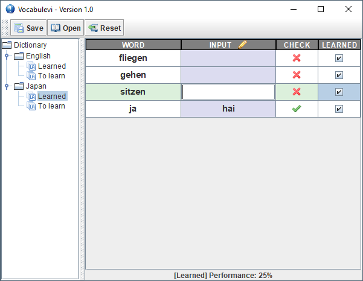

# simple vocabulary trainer
- good old desktop app. still works. compiled with jdk 11.
- the hole persistence is done in a text file (vocabulevi.txt)

## text file syntax
- introduce a new language 
> language=LANGUAGE e.g. language=JAPAN 
- vocabulary definition (whereas 0|1 defines the status for learned or not)
> source,target,0|1 e.g. programmieren,program,0

 